# Database ER Diagram

Reflects the actual EF Core model in `backend/src/Models/Entities/` and `backend/src/Data/Context/AppDbContext.cs` as of 2026-09-15 (16 migrations applied, most recently `AddRevokedTokens` and `AddTemplateServiceProcedureLink`) — not the aspirational schema in `docs/Government_Service_Navigator_Project_Plan.md`. See the callouts below the diagram for where the two diverge.

```mermaid
erDiagram
    User {
        int Id PK
        string Email UK
        string PasswordHash
        string FullName
        string NicNumber
        string Role
        datetime CreatedAt
    }

    Officer {
        int Id PK
        string Name
        string Email UK
        string PasswordHash
        string Role
        string Department
        string Status
        datetime CreatedAt
    }

    Admin {
        int Id PK
        string Email UK
        string PasswordHash
        string Role
        datetime CreatedAt
    }

    RevokedToken {
        int Id PK
        string Jti UK
        datetime ExpiresAt
        datetime RevokedAt
    }

    Template {
        guid Id PK
        string FormName
        string SubTitle
        string LawText
        string Status
        datetime CreatedAt
        int ServiceProcedureId FK "nullable, SetNull on delete"
    }

    FormField {
        guid Id PK
        guid TemplateId FK
        string Label
        string Type
        string Options
        bool IsRequired
        int OrderIndex
    }

    ServiceProcedure {
        int Id PK
        string ServiceId UK
        string Name
        string Category
        string Status "Draft, Active, Retired"
    }

    EligibilityRule {
        int Id PK
        int ServiceProcedureId FK
        string Field
        string Operator
        string Value
        bool IsStrict
    }

    DocumentRequirement {
        int Id PK
        int ServiceProcedureId FK
        string DocumentName
        string Description
        bool IsMandatory
    }

    FeeSchedule {
        int Id PK
        int ServiceProcedureId FK
        string FeeType
        decimal Amount
        datetime EffectiveDate
    }

    VerificationTask {
        int Id PK
        int ApplicationId "no FK - no Application entity exists yet"
        string Status "Pending, Approved, Rejected, Revised"
        datetime CreatedDate
    }

    OfficerReview {
        int Id PK
        int TaskId FK
        string OfficerId "string, NOT an FK to Officer.Id"
        datetime ReviewDate
        string Comments
        int RejectionReasonId FK "nullable"
    }

    ComplianceCheck {
        int Id PK
        int TaskId FK
        string CheckType
        bool IsPassed
        string Details
    }

    RejectionReason {
        int Id PK
        string Code
        string Description
    }

    AuditLog {
        int Id PK
        int ApplicationId "no FK - no Application entity exists yet"
        string Action
        string PerformedBy
        datetime Timestamp
        string OldValues
        string NewValues
    }

    ServiceProcedure ||--o{ Template : "optionally links (SetNull)"
    Template ||--o{ FormField : "cascade delete"
    ServiceProcedure ||--o{ EligibilityRule : has
    ServiceProcedure ||--o{ DocumentRequirement : has
    ServiceProcedure ||--o{ FeeSchedule : has
    VerificationTask ||--o{ OfficerReview : has
    VerificationTask ||--o{ ComplianceCheck : has
    RejectionReason ||--o{ OfficerReview : "optionally explains"
```

## Notes on real gaps (not diagram omissions)

- **No `Application` entity exists.** `VerificationTask.ApplicationId` and `AuditLog.ApplicationId` are plain `int` columns with no foreign key to anything, because Component B (Application & Case Management — see the project plan) hasn't been built yet. A `VerificationTask` today is created directly by an officer (`POST /api/verification/tasks` with just an `ApplicationId` int) rather than against a real submitted case.
- **`User`, `Officer`, and `Admin` are unrelated tables**, not one polymorphic identity table — see `docs/adr/0003-separate-user-officer-admin-tables.md` for why, and its consequences (e.g. `OfficerReview.OfficerId` is a bare string, not a foreign key into `Officer.Id`, so there's no referential integrity between a review and the officer who made it).
- **`RevokedToken` isn't tied to any identity table** either — it just stores a JWT's `jti` (works the same regardless of whether the token belonged to a `User`, `Officer`, or `Admin`). See `docs/adr/0001-jwt-auth-with-revocation-table.md`.
