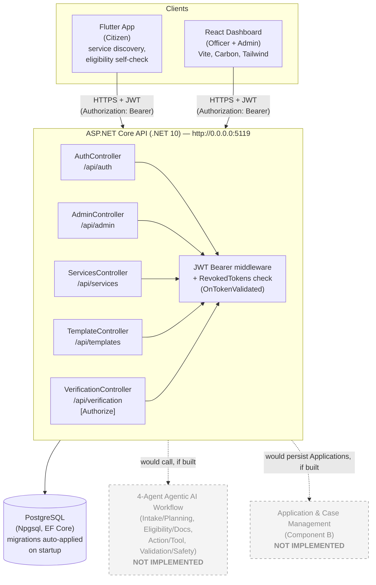

# System Architecture

Reflects what's actually running as of 2026-09-15. The four-agent "Agentic AI" workflow and the Payments/Notifications/Analytics component described in `docs/Government_Service_Navigator_Project_Plan.md` are **not implemented** — there is no agent orchestration code anywhere in `backend/`. They're shown greyed out below so this diagram stays honest about the gap instead of quietly dropping them.

## What's actually enforced vs. what looks enforced

The diagram shows every controller routed through the JWT middleware because that middleware is globally registered (`app.UseAuthentication()` in `Program.cs`) — but registration isn't the same as a controller requiring it. Only actions decorated with `[Authorize]` actually reject unauthenticated requests. As of this writing that's:

- `VerificationController` (every action)
- `AuthController.Logout` only (the one action added alongside `docs/adr/0001-jwt-auth-with-revocation-table.md`)

`AdminController`, `ServicesController`, and `TemplateController` have **no `[Authorize]` anywhere** — every officer-management, service-catalog, and template CRUD endpoint is reachable by an unauthenticated request today. See `docs/adr/0004-client-side-department-scoping.md` and `docs/api.md` for the full breakdown and why this matters beyond just department scoping.

## Client → API base URLs

Neither client reads an environment variable for the API base URL — both hardcode `http://localhost:5119`:

- **React**: every `fetch()` call across `web/src/**` uses the literal string.
- **Flutter**: `mobile/lib/services/service_api_client.dart` hardcodes it too, with a comment flagging that an Android emulator needs `10.0.2.2` instead of `localhost` (physical devices need the host machine's LAN IP).

There is currently no `.env`/config-module mechanism on either client to change this without editing source — see the README's Web/Mobile Setup sections.
